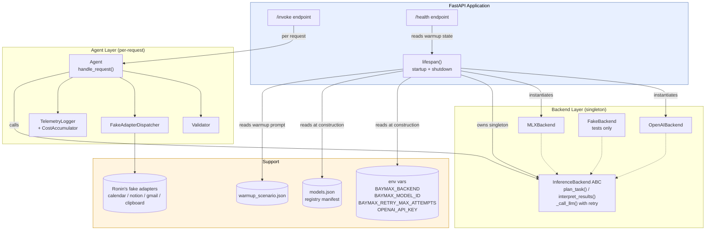
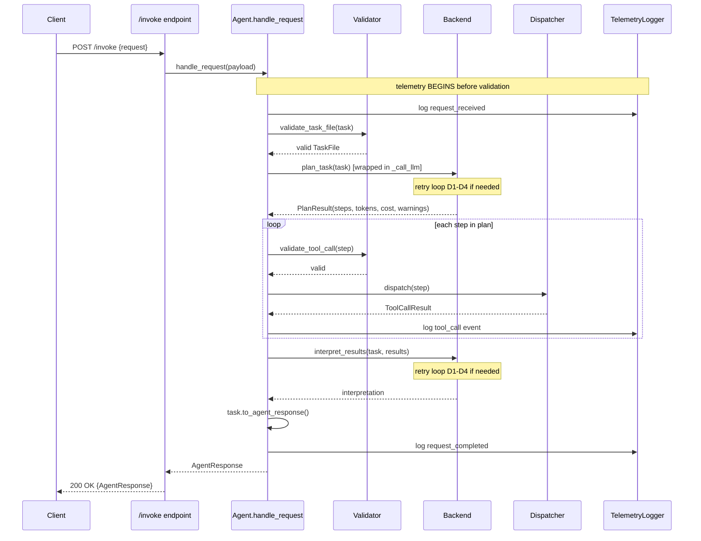
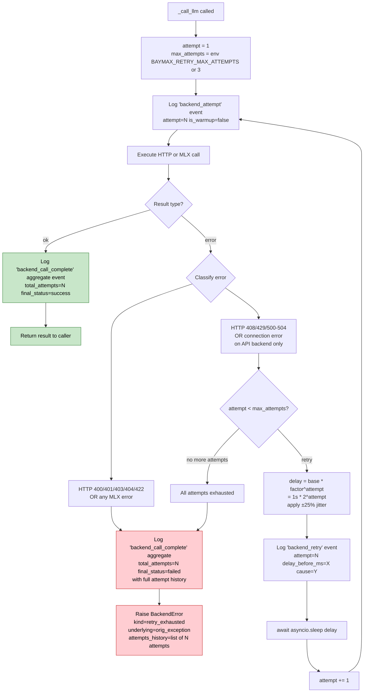
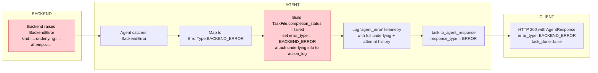
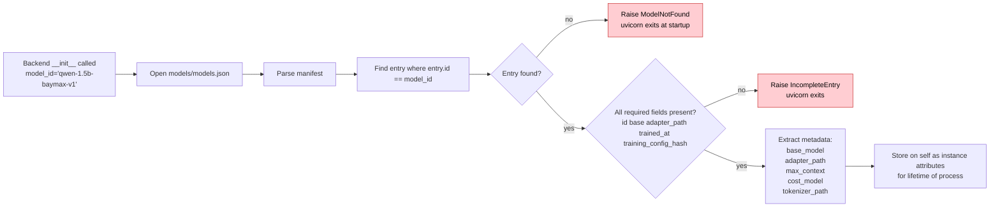
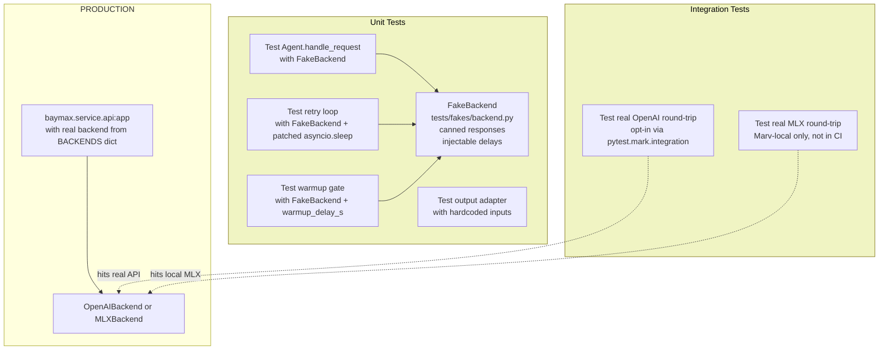

# Backend + Agent Design Flow (post-ADR-0011 target)

**Purpose**: Reference diagrams for the backend interface v2 + agent core design decided during the ADR 0011 walkthrough (2026-08-21).

**Scope note**: This document shows the **target design** after ADR 0011 + ADR 0012 ship. The current Phase 1 codebase reflects an earlier state (OpenAIBackend only, no registry, simpler warmup semantics). Diagrams here are the shape you're building TO, not the shape currently deployed.

**Related**:
- ADR 0011 (backend interface v2 — to write)
- ADR 0012 (model registry — to write, co-designed with 0011)
- METHODOLOGY.md
- ARCHITECTURE.md

---

## 1. Component composition

The system's structural layering. Shows what holds what.



**Key composition rules** (from A/B/G locks):
- Agent HOLDS backend (dependency injection); Agent does not KNOW backend type
- Backend HOLDS registry entry (registry-driven metadata per G1)
- FastAPI lifespan OWNS the singleton backend instance
- Everything reads env vars in `__init__` (per B4); no global env access elsewhere

---

## 2. Startup lifecycle

The sequence from `uvicorn baymax.service.api:app` to `/health` returning 200.

```mermaid
flowchart TD
    START([uvicorn starts])
    IMPORT[Import module<br/>side-effect free]
    LIFESPAN_ENTER[lifespan begins]

    ENV_READ[Read BAYMAX_BACKEND<br/>+ BAYMAX_MODEL_ID env]
    ENV_VALID{Env valid?}
    ENV_FAIL[Raise ValueError<br/>uvicorn exits]

    FACTORY[BACKENDS dict lookup<br/>OpenAIBackend or MLXBackend]

    REG_READ[Load models.json<br/>fetch model_id entry]
    REG_VALID{Entry valid?<br/>required fields present?}
    REG_FAIL[Raise ModelNotFound / SchemaError<br/>uvicorn exits]

    BACKEND_INIT[Backend __init__<br/>fetches OPENAI_API_KEY or MLX_MODEL_PATH<br/>raises loud on missing]
    BACKEND_FAIL{Init succeeded?}
    BACKEND_FAIL_EXIT[Raise ConfigError<br/>uvicorn exits]

    WARM_LOAD[Read warmup_scenario.json]
    WARM_RUN[Execute dummy scenario<br/>full backend call incl. tool-call generation]
    WARM_TIMEOUT{Completed within 120s?}
    WARM_TIMEOUT_FAIL[Raise WarmupTimeout<br/>uvicorn exits]
    WARM_ERR{Warmup succeeded?}
    WARM_ERR_FAIL[Raise WarmupFailure with stage+cause+hint<br/>uvicorn exits]

    READY[Set warmed_up = True<br/>Log 'backend ready' event with is_warmup=true tag]
    YIELD[lifespan yields<br/>server accepts requests]

    HEALTH_200[/health returns 200<br/>with backend metadata JSON]

    START --> IMPORT
    IMPORT --> LIFESPAN_ENTER
    LIFESPAN_ENTER --> ENV_READ
    ENV_READ --> ENV_VALID
    ENV_VALID -- no --> ENV_FAIL
    ENV_VALID -- yes --> FACTORY
    FACTORY --> REG_READ
    REG_READ --> REG_VALID
    REG_VALID -- no --> REG_FAIL
    REG_VALID -- yes --> BACKEND_INIT
    BACKEND_INIT --> BACKEND_FAIL
    BACKEND_FAIL -- no --> BACKEND_FAIL_EXIT
    BACKEND_FAIL -- yes --> WARM_LOAD
    WARM_LOAD --> WARM_RUN
    WARM_RUN --> WARM_TIMEOUT
    WARM_TIMEOUT -- no --> WARM_TIMEOUT_FAIL
    WARM_TIMEOUT -- yes --> WARM_ERR
    WARM_ERR -- no --> WARM_ERR_FAIL
    WARM_ERR -- yes --> READY
    READY --> YIELD
    YIELD --> HEALTH_200

    classDef fail fill:#ffcdd2,stroke:#c62828,color:#000
    classDef success fill:#c8e6c9,stroke:#2e7d32,color:#000
    class ENV_FAIL,REG_FAIL,BACKEND_FAIL_EXIT,WARM_TIMEOUT_FAIL,WARM_ERR_FAIL fail
    class READY,HEALTH_200 success
```

**Failure semantics** (per B5, C3, C4):
- All startup errors = process exit before `lifespan` yields
- `/health` never reaches ready state; uvicorn logs the error and dies
- No retry on warmup failures (deterministic errors, fail-loud policy)

**Health response body** (per C2):
```json
// During warmup (503):
{"ready": false, "reason": "warming_up"}

// After warmup (200):
{"ready": true, "backend": "mlx", "model_id": "qwen-1.5b-baymax-v1"}
```

---

## 3. Request flow (happy path)

Single request from user through agent to response.



**Order guarantees** (from ADR 0001, 0002):
- Telemetry always fires BEFORE validation (per Phase 1 lock — captures failed-task_file-construction events)
- Validator runs on both the initial TaskFile and each ToolCall step before dispatch
- Agent uses meta-tools (`request_clarification`, `refuse_request`) as normal tool calls — dispatched but with no side effects, sets response_type accordingly

---

## 4. Retry loop internals (inside `_call_llm`)

The retry logic that lives on the base class per A4, implementing D1-D5.



**Backoff formula** (per D2):
```
delay = base_delay * (factor ** attempt_number)
      = 1s * (2 ** attempt)   # 1s, 2s, 4s
delay_with_jitter = delay * uniform(0.75, 1.25)
```

**Retry sensitivity sweep** (per D1 lock):
Eval infrastructure runs with `BAYMAX_RETRY_MAX_ATTEMPTS ∈ {1, 2, 3, 5}` and reports failure rate per N. Measures whether retries are a load-bearing variable in the eval or extraneous noise.

---

## 5. Error surfacing → AgentResponse

How a `BackendError` (from retry exhaustion or non-retriable error) becomes an `AgentResponse` for the client.



**Key semantic** (per E2): backend failures become a distinct `ErrorType.BACKEND_ERROR` in the ErrorType enum. Scorer can bucket these separately from agent-logic failures (validator errors, ambiguous requests). This preserves the distinction between "the model failed to respond" and "the plan the model produced was invalid."

**HTTP status**: still 200 on the wire. The failure is captured semantically in `AgentResponse.error_type`. Only true HTTP infrastructure errors (server down, invalid JSON in) return non-200.

---

## 6. Registry lookup path (per G1)

How a backend obtains its model metadata at construction.



**Consequence of registry-driven** (per G1): adding a new fine-tuned model is a REGISTRY UPDATE, not a backend code change. Ronin appends to `models.json` + drops adapter weights → backend picks it up on next startup with `BAYMAX_MODEL_ID` pointing at the new id.

**Immutability guarantee** (per RONIN_SYNC B3): a given `model_id` NEVER has its metadata rewritten. Every retrain = new id (`v1` → `v2` → `v3`). Any prior eval result labeled with the old id stays reproducible.

---

## 7. Testing surface (per F)

Where fakes and mocks live and how they interact.



**Test tiers**:
| Tier | Runs when | Env |
|---|---|---|
| Unit tests (FakeBackend) | Every commit / PR | No env needed |
| Integration OpenAI | `[test-integration]` PR tag OR manual | `OPENAI_API_KEY` set |
| Integration MLX | Marv-local only, before pushing MLX changes | Mac with weights downloaded |

**Not scheduled**: no nightly CI runs. Ahmed's eval runs naturally catch drift.

---

## 8. Cross-diagram invariants

Rules that hold across all flows:

1. **Backend uniformity** — Agent code has ZERO backend-conditional logic. Every backend implements identical semantics. Format differences absorbed inside backend implementations.
2. **Backend metadata exposed but not consumed by agent** — `backend.max_context`, `backend.cost_model` accessible for telemetry/debugging, NOT for agent branching.
3. **Registry is source of truth for model facts** — no duplication in backend code.
4. **Immutable model IDs** — `v1` weights + metadata never change. Retrain → new ID.
5. **Fail-loud on deterministic errors** — MLX errors, config errors, warmup errors all exit the process rather than retry.
6. **Retry only on network-transient errors** — API backends only. All retry attempts logged per-event AND aggregated on completion (dual telemetry per D5).
7. **Telemetry BEFORE validation** — request events fire before validator runs, so failed-task_file-construction events are captured.
8. **No agent-level backend awareness** — Agent gets a backend via dependency injection, treats it as opaque.

---

## 9. What's NOT in this design (still deferred)

Called out so they're not confused with the current design:

- **Streaming inference** (A5) — deferred to v2; new `plan_task_stream()` method when added, does not break v1 callers
- **State store beyond in-memory** — ADR 0007 downgraded to v2 target; no SQLite in v1
- **Multi-turn dialog state** — v2/v3 per DEFERRED.md
- **Real tool adapters** (Notion/Gmail/Calendar/Clipboard) — v3+; v1 uses Ronin's fake adapters
- **LLM-as-judge scoring** — ADR 0008 scaffold, implementation deferred
- **Third + fourth backend classes** (Anthropic, other MLX variants) — factory dict makes trivial to add; not v1 scope
- **Backend capability declaration via `.capabilities()`** — considered and rejected in favor of interface uniformity (§8 invariant #1). If a 4th+ backend surfaces genuine capability divergence, revisit.

---

**Written**: 2026-08-21 as reference design artifact from ADR 0011 walkthrough.
